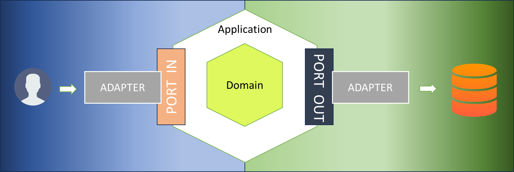
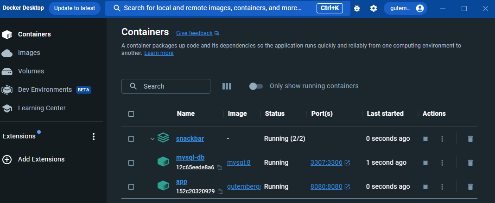
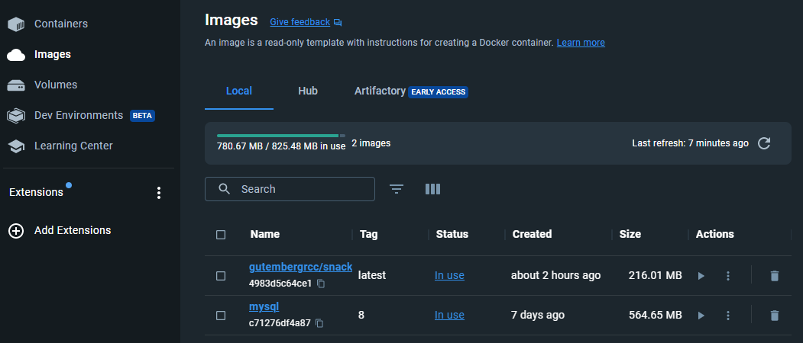
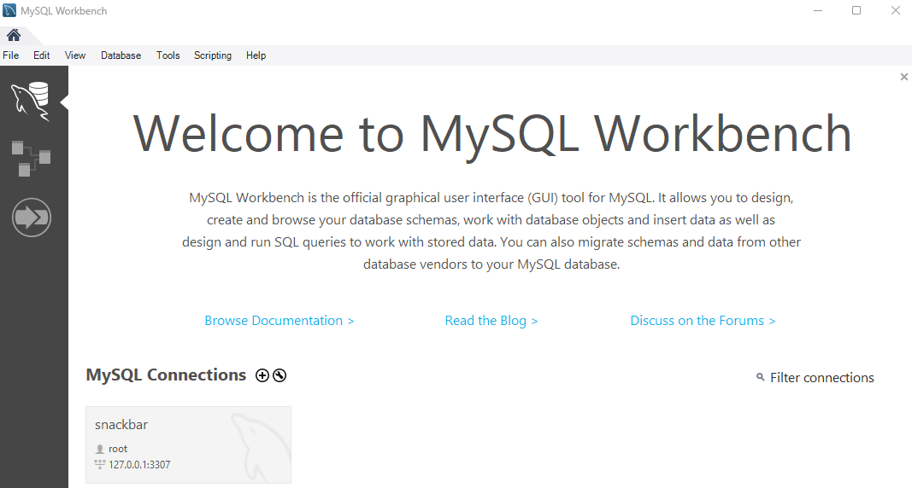
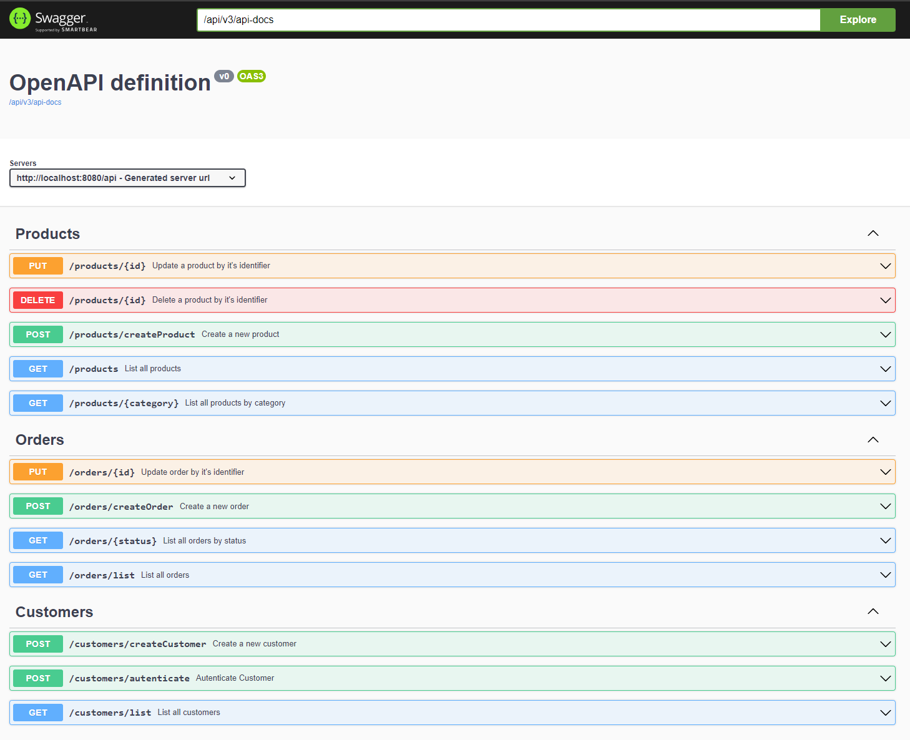

<center>
  <p align="center">
    &nbsp;
    
  </p>  
  <h1 align="center">Ports and Adapter / Arquitetura Hexagonal</h1>
  <br align="center">
    Este projeto tem a finalidade educacional, como parte do Tech Challenge do Curso de Arquitetura de Software.
</center>

# Conceito

## O que é Arquitetura Hexagonal?

A arquitetura hexagonal, também conhecida como Arquitetura Ports and Adapters (portas e adaptadores) ou Arquitetura Clean,  
é um padrão de arquitetura de software que visa a separação clara de diferentes preocupações em um sistema. 
Ela foi proposta por Alistair Cockburn em 2005 e é amplamente utilizada na construção de aplicações empresariais. </p>
A arquitetura hexagonal baseia-se em três princípios fundamentais: separação de responsabilidades, inversão de dependências e testabilidade. 
O objetivo principal é tornar o sistema independente de detalhes de implementação e tecnologias específicas, facilitando a evolução e manutenção do código.

Entre as caracteristicas, podemos citar:

* Camada de Domínio: Essa é a camada central do hexágono e contém a lógica de negócio do sistema. Ela é independente de qualquer tecnologia e deve ser o núcleo do software, contendo as regras e entidades do domínio.

* Adaptadores de Interface: Essa camada é responsável por fornecer uma interface com o mundo externo. Ela abrange as interfaces de entrada e saída, como interfaces de usuário, APIs, serviços web, etc. Os adaptadores de interface recebem as solicitações externas e as convertem em chamadas para os serviços do domínio, e vice-versa.

* Adaptadores de Infraestrutura: Essa camada lida com a comunicação entre o sistema e os recursos externos, como bancos de dados, serviços de terceiros, sistemas de arquivos, entre outros. Os adaptadores de infraestrutura são responsáveis por implementar as interfaces definidas pela camada de domínio.



A arquitetura hexagonal permite a fácil substituição e testabilidade das diferentes partes do sistema, uma vez que cada camada possui responsabilidades bem definidas e dependências bem gerenciadas. Além disso, ela promove a modularidade e a reutilização de código, pois as diferentes partes do sistema são desacopladas e podem ser alteradas ou substituídas independentemente umas das outras.

Em resumo, a arquitetura hexagonal é uma abordagem de design de software que enfatiza a separação de responsabilidades e a inversão de dependências. Ela facilita a evolução, manutenção e teste de sistemas, tornando-os mais flexíveis, modulares e adaptáveis a mudanças.

## Decisão Arquitetural do Desafio


**Adapters**

Eles são as dependências externas (interface do usuário/entrada e infraestrutura/saída)

* `adapter/inbound`: Estão os controladores.
* `adapter/outbound`: Estão as integrações externas (repositório, integração de API etc).

**Domínio**

Aqui temos todas as nossas classes que não possuem nenhuma dependência, incluindo dependências de framework.

* `application/core/domain`: Classes de dominio, projetadas com a utilização de práticas do DDD.
* `application/ports/inbound`: Interfaces que representam nossos casos de uso.
* `application/ports/outbound`: Interfaces que representam os serviços externos. Observe que aqui não temos nenhuma nomenclatura ligada às tecnologias.
* `application/core/usecase`: Implementação dos casos de uso.

# Vamos Executar?

## Ferramentas necessárias / Pré-requisitos

- JDK 17
- IDE de sua preferência
- Docker
- O banco de dados utilizado é o MySQL, caso queira ver os dados é sugerido a utilização do SGBD mySQL Workbench

## Como executar?

**1. Clonar o repositório:**
```sh
git clone https://github.com/gutembergrcc/snackbar.git
```

**2. Subir a aplicação e o banco de dados MySQL com Docker:**
```shell
docker-compose up -d
```

**3. Após a execução do comando acima será baixado as imagens do MySQL e da Aplicação presente no DockerHub e os containers serão iniciados.**
```
[+] Running 3/3
 ✔ Network snackbar_network     Created                                                                                                                                                                                                                                                                                                                                                                                          0.7s 
 ✔ Container snackbar-mysql-db  Started                                                                                                                                                                                                                                                                                                                                                                                          1.9s 
 ✔ Container snackbar-app       Started 
```
Pronto! Aguarde que em instantes o MySQL irá estar pronto para ser consumido
na porta 3307. Por conflito de porta com a 3306 foi escolhido a local 3307.

Ver imagem abaixo a organização no Docker Desktop:

**- Containers**



**- Images**



O MySQL já estará disponível:



**4. No diretório `src/main/resources/db.migration` está disponível as DDLs a serem executadas com a finalidade de criação das tabelas.**

**5. Como a aplicação também foi inicializada a mesma possui uma interface Swagger, disponível em: http://localhost:8080/api/swagger-ui/index.html**



## Sou Desenvolvedor, tem informações a mais?

## Docker

`docker-compose.yml`: YAML (Yet Another Markup Language) que é usado para definir, configurar e executar aplicativos multi-container usando o Docker. Em nosso arquivo configuramos 2 serviços,
um para o base de dados e outro para a aplicação. Foi adicionado uma configuração extra, pois as vezes a aplicação subia antes da base de dados, com isso foi configurado alguns Waits.
Nesse mesmo arquivo possui a configuração de rede do docker e os mapeamos de portas dos serviços.

`Dockerfile`: Dockerfile apontando para um image do `eclipse-temurin:17.0.5_8-jre-alpine`. A imagem Docker do Eclipse Temurin permite que você execute aplicativos Java em um ambiente isolado e portátil.
Nesse caso, "17.0.5_8" indica a versão do Java 17.0.5, enquanto "jre" significa que a imagem contém apenas a Java Runtime Environment, que é o ambiente de execução do Java, sem o kit de desenvolvimento (JDK). Por fim, "alpine" refere-se à base da imagem, que é a distribuição leve Alpine Linux
Nesse mesmo arquivo copiamos o Jar gerado pela aplicação, criamos um Usuário e Grupo e executamos o Jar da aplicação.

`Dockerfile.dev`: Muito similar com a configuração acima, a diferença que esse Dockerfile tem o comando para atualizar e regerar o Jar da aplicação.

### Comandos úteis do Docker


Gerar a Imagem da Aplicação atraves do DockerFile
```shell
docker build -t gutembergrcc/spring-boot-docker-language-app .
```

Caso queira gerar o build do Gradle e gerar a imagem, basta executar o comando abaixo:
```shell
docker build -f Dockerfile.dev -t gutembergrcc/spring-boot-docker-language-app:latest .
```

Para subir a imagem para o Hub:
```shell
docker push gutembergrcc/spring-boot-docker-language-app
```

## Quero desenvolver novos Use Cases, qual a forma mais rápida de testar?

1. Sugiro atualizar o docker-compose temporariamente apenas com o serviço de banco de dados:

````
version: '3.7'

services:
  snackbar-mysql-db:
    container_name: snackbar-mysql-db
    image: mysql:8
    environment:
      - MYSQL_ROOT_PASSWORD=123456
      - MYSQL_DATABASE=snackbar
    ports:
      - 3307:3306
    networks:
      - snackbar_network
networks:
  snackbar_network:
    driver: bridge
    name: snackbar_network
````

2. É possível executar como uma aplicação Java através do método main() na classe Main.java

Obs. Com essa abordagem o desenvolvimento se torna mais rápido, pois não teremos que regerar Jar e atualizar no Docker, mas os testes tem
que ser no Docker, pois reflete o ambiente do "Cliente".

## Configuração da Aplicação

Nos arquivos `src/main/resources/application.yml` e `src/main/resources/application-developmente.yml` temos as configurações da aplicação, ou seja:
- Configuração do datasource
- Configuração do JPA
- Configurações do Spring Boot
- Dados de Acesso a base de dados